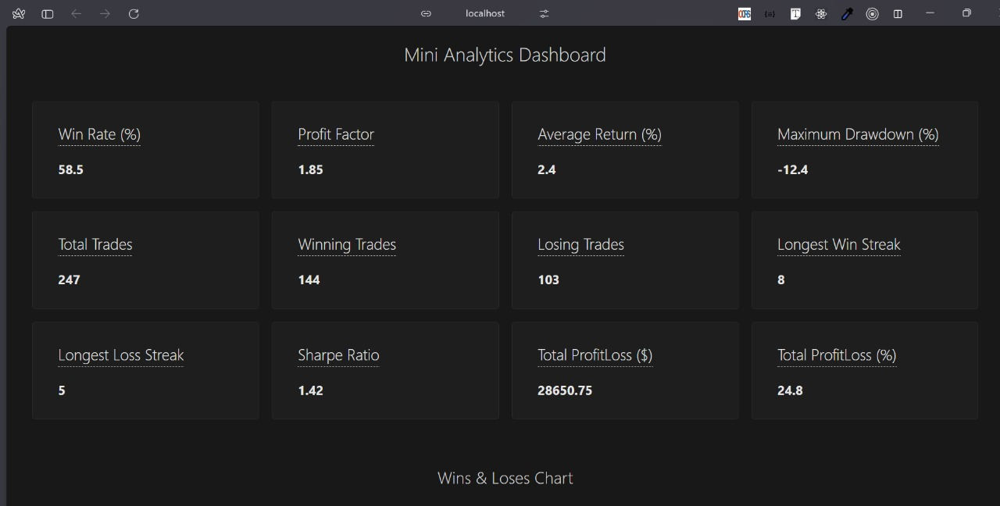
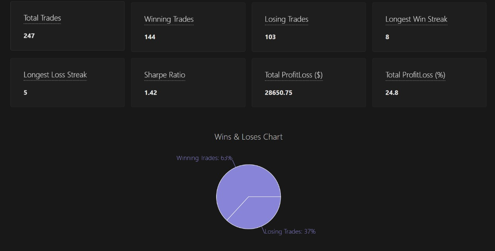
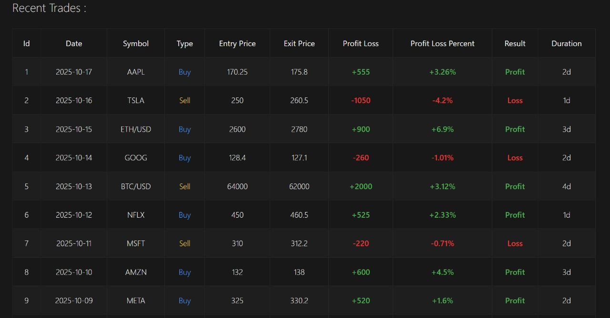

# Mini dashboard

Mini Dashboard displaying trading analytics

## Features

- Displays key trading metrics like Win Rate, Profit Factor, Sharpe Ratio, etc.

- Shows a pie chart for winning and losing trades

- Displays a responsive table of the most recent trades

- Backend mimics providin JSON data 

## Dashboard Screenshots


*dashboard-ui*


*charts-ui*


*trades-table-ui*


##  Project Structure

```text
project/
│
├── client/ → Frontend (React)
├── server/ → Backend (Express)
└── README.md
```

## Tech Stack

- **Frontend:** React, Vite, Recharts, CSS  
- **Backend:** Node.js, Express  
- **Communication:** REST API (JSON)  
- **Chart Library:** Recharts (for visualizing data)

## Requirements

Before running the project, make sure you have:

- [Node.js](https://nodejs.org/) (version 18 or higher)
- npm (comes with Node.js) or yarn

## Setup Instructions

### 1. Setup Backend (Server)

#### Step 1: Move into the server folder
```bash
cd server
```

#### Step 2: Install dependencies
```bash
npm install
```

#### Step 3: Start the server
```bash
node index.js
```

By default, the backend will run at: `http://localhost:3000`

#### Step 4: Test the API
Visit this URL in your browser: `http://localhost:3000/analytics`

You should see a JSON response containing `metricsData` and `recentTrades`.

### 2. Setup Frontend (Client)

#### Step 1: Move into the client folder
```bash
cd ../client
```

#### Step 2: Install dependencies
```bash
npm install
```

#### Step 3: Start the frontend
```bash
npm run dev
```

By default, the React app will run at: `http://localhost:5173`

The frontend automatically fetches analytics data from the backend's `/analytics` endpoint and displays:
- Performance metrics
- Win/Loss pie chart
- Recent trades table

